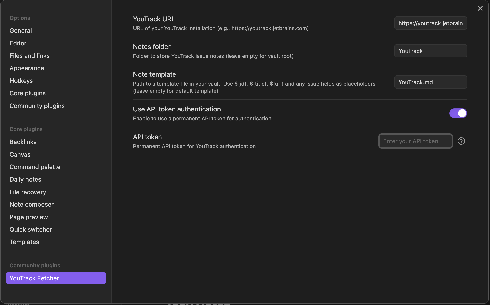
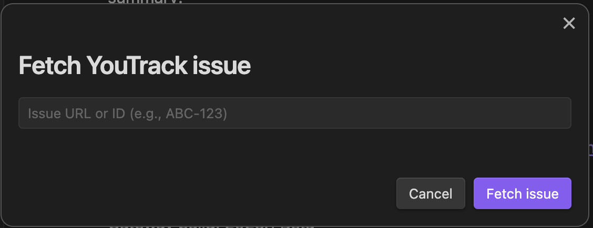

# YouTrack Fetcher

This Obsidian plugin allows you to quickly fetch YouTrack issues and create notes from them in your Obsidian vault.

## Features

- Fetch YouTrack issues by ID and create structured notes
- Easy access via keyboard shortcut
- API token authentication support
- Configurable folder for storing issue notes
- Configurable note template

## Installation

### From Obsidian Community Plugins

1. Open Obsidian
2. Go to Settings > Community plugins
3. Disable Safe mode if necessary
4. Click Browse and search for "YouTrack Fetcher"
5. Install the plugin
6. Enable the plugin after installation

### Manual Installation

1. Download the latest release from the GitHub repository
2. Extract the ZIP file into your Obsidian vault's `.obsidian/plugins/` folder
3. Enable the plugin in Obsidian settings

## Usage

1. Set up your YouTrack instance URL in plugin settings
2. Configure API token if required for your YouTrack instance
   
3. Use the keyboard shortcut or click the clipboard icon in the ribbon
   
4. Enter the issue ID
5. Click "Fetch Issue" to create a note based on the issue data
   

## Note Format

The plugin creates notes with the following format. As an alternative, specify your own template in the plugin settings.

```markdown
# ${id}: ${title}

URL: ${url}

## Description

${description}
```

## Requirements

- Obsidian v0.15.0 or higher
- Access to a YouTrack instance (cloud or self-hosted)

## Troubleshooting

- If you have trouble authenticating, make sure your API token has proper permissions
- For self-hosted instances, check that the REST API is accessible

## Development

Run the development build with change watch:

```shell
yarn build
```

Run the TypeScript type check:

```shell
yarn typecheck
```

Run the production build:

```shell
yarn build --production
```

Bump the version in `package.json` and `manifest.json` and add a tag:

```shell
yarn version
```

Publish a new release from the added tag:

```shell
git push --tags
```

## License

This plugin is licensed under the MIT License.
